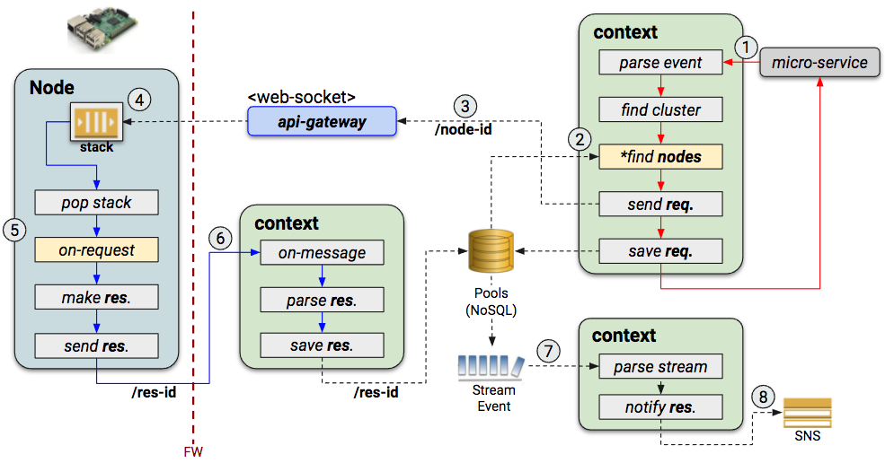

# serverless-clusters

Serverless Clustering w/ Stateless Computing (Lambda)

- support multi cluster groups.
- support realtime monitoring via AWS web-socket.
- support NoSQL (DynamoDB) datbase and event-stream.
- support synchronous request via rest-api
- support asynchronous multi requests.

## Architecture

1. Realtime Monitoring of nodes.

    

1. Synchronous request directly to a node.

    
 
1. Asynchronous multi requests to nodes.

    

## Development

```sh
# install nodejs package
$ npm install
# deploy to AWS w/ profile <lemon>
$ npm run deploy.lemon
```

## License

[MIT License](LICENSE)

